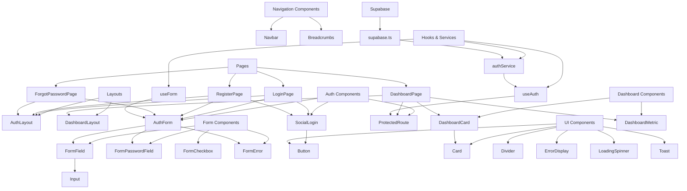
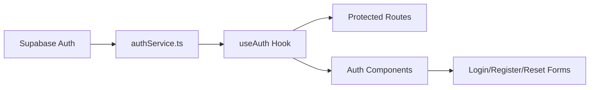
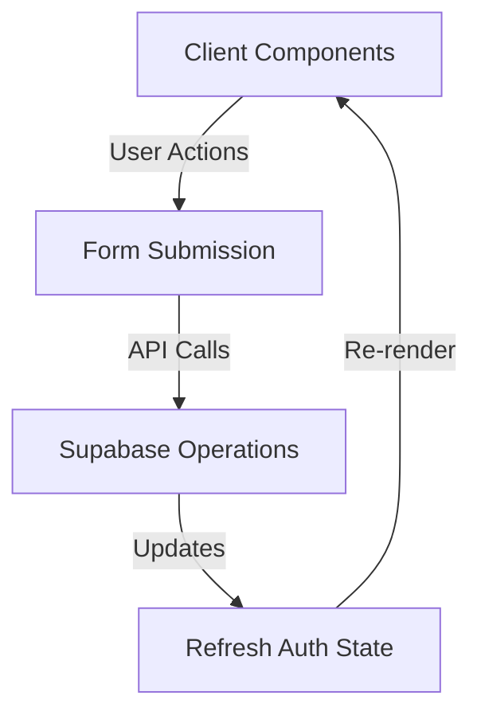

# Component Architecture Overview

This document provides a comprehensive overview of our proposed component architecture, focusing on the relationships between components and how they integrate with Supabase.

## Component Hierarchy



## Supabase Integration Points

Our component architecture interacts with Supabase at specific integration points:

### 1. Authentication Service Layer



**Key Integration Points:**
- `authService.ts` - Abstracts all Supabase auth operations
- `useAuth` hook - Manages auth state and exposes auth operations
- Auth components - Consume auth services via useAuth hook

### 2. Data Flow



## Component Improvements for Supabase

### Authentication Components

#### Current Implementation
- Direct Supabase auth calls in components
- Inconsistent error handling
- Duplicated authentication logic

#### Improved Implementation
- Centralized auth service layer
- Consistent error handling
- Type-safe request/response handling

```typescript
// Example improved auth service usage
import { useAuth } from '@/hooks/useAuth';

function LoginForm() {
  const { signIn, error, isLoading } = useAuth();
  
  const handleSubmit = async (values) => {
    await signIn(values.email, values.password);
  };
  
  return (
    <AuthForm
      fields={loginFields}
      onSubmit={handleSubmit}
      isLoading={isLoading}
      error={error}
    />
  );
}
```

### Protected Routes

#### Current Implementation
- Redirect logic mixed with component rendering
- Inconsistent loading states

#### Improved Implementation
- Dedicated ProtectedRoute component
- Consistent loading states
- Seamless integration with auth hook

```typescript
// Example improved Protected Route usage
function DashboardPage() {
  return (
    <ProtectedRoute>
      <DashboardContent />
    </ProtectedRoute>
  );
}
```

### Form Components

#### Current Implementation
- Direct form state management in components
- Inconsistent validation
- Repeated error handling

#### Improved Implementation
- Reusable form components
- Centralized form state via useForm hook
- Consistent error presentation

```typescript
// Example improved form usage
function RegisterForm() {
  const { values, handleChange, errors, handleSubmit } = useForm({
    email: '',
    password: '',
    confirmPassword: ''
  });
  
  return (
    <form onSubmit={handleSubmit(onRegister)}>
      <FormField name="email" label="Email" error={errors.email}>
        <Input
          type="email"
          name="email"
          value={values.email}
          onChange={handleChange}
        />
      </FormField>
      {/* Other fields */}
    </form>
  );
}
```

## Component-Supabase Integration Patterns

### 1. Data Fetching Pattern

```typescript
// Server component
import { createClient } from '@/lib/supabase/server';

async function ProfileServerComponent({ userId }) {
  const supabase = createClient();
  const { data, error } = await supabase
    .from('profiles')
    .select('*')
    .eq('id', userId)
    .single();
    
  if (error) {
    return <ErrorDisplay message={error.message} />;
  }
  
  return <ProfileDisplay profile={data} />;
}

// Client component with SWR
'use client'
import useSWR from 'swr';

function ProfileClientComponent({ userId }) {
  const { data, error, isLoading } = useSWR(
    `/api/profiles/${userId}`, 
    fetcher
  );
  
  if (isLoading) return <LoadingSpinner />;
  if (error) return <ErrorDisplay message={error.message} />;
  
  return <ProfileDisplay profile={data} />;
}
```

### 2. Authentication Pattern

```typescript
// Server-side auth check
import { cookies } from 'next/headers';
import { createClient } from '@/lib/supabase/server';

export async function getServerSideUser() {
  const cookieStore = cookies();
  const supabase = createClient(cookieStore);
  const { data: { user } } = await supabase.auth.getUser();
  return user;
}

// Client-side auth state
'use client'
import { useAuth } from '@/hooks/useAuth';

function AuthenticatedComponent() {
  const { user, isLoading } = useAuth();
  
  if (isLoading) return <LoadingSpinner />;
  if (!user) return null;
  
  return <div>Welcome, {user.email}</div>;
}
```

### 3. Form Submission Pattern

```typescript
// Server action
'use server'
import { createClient } from '@/lib/supabase/server';
import { revalidatePath } from 'next/cache';

export async function updateProfile(formData: FormData) {
  const supabase = createClient();
  
  const { error } = await supabase
    .from('profiles')
    .update({
      name: formData.get('name'),
      bio: formData.get('bio')
    })
    .eq('id', formData.get('id'));
    
  if (error) {
    return { error: error.message };
  }
  
  revalidatePath('/profile');
  return { success: true };
}

// Client component
'use client'
import { updateProfile } from './actions';

function ProfileForm({ initialData }) {
  const [isPending, startTransition] = useTransition();
  
  function handleSubmit(e) {
    e.preventDefault();
    const formData = new FormData(e.target);
    
    startTransition(() => {
      updateProfile(formData);
    });
  }
  
  return (
    <form onSubmit={handleSubmit}>
      {/* Form fields */}
      <Button type="submit" isLoading={isPending}>Save</Button>
    </form>
  );
}
```

## Recommended Implementation Path

1. **Foundational Components**
   - Focus on form components first
   - Create form hooks and utilities
   - Implement error handling components

2. **Authentication Integration**
   - Refine auth service
   - Implement auth hooks
   - Create protected route components

3. **UI Component Library**
   - Build layout components
   - Implement dashboard-specific components
   - Add navigation components

4. **Page Refactoring**
   - Update authentication pages
   - Enhance dashboard with new components
   - Ensure consistent styling and behavior

## Conclusion

This component architecture provides a solid foundation for our application while ensuring seamless integration with Supabase. By following the patterns and implementation path outlined in this document, we can achieve a modular, maintainable, and feature-rich application.

The component improvements focus on:
1. Separation of concerns
2. Reusability
3. Type safety
4. Consistent patterns
5. Improved user experience

This architecture allows us to leverage Supabase features effectively while maintaining a clean and maintainable codebase.