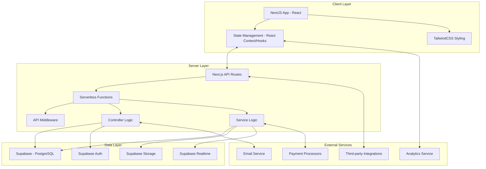
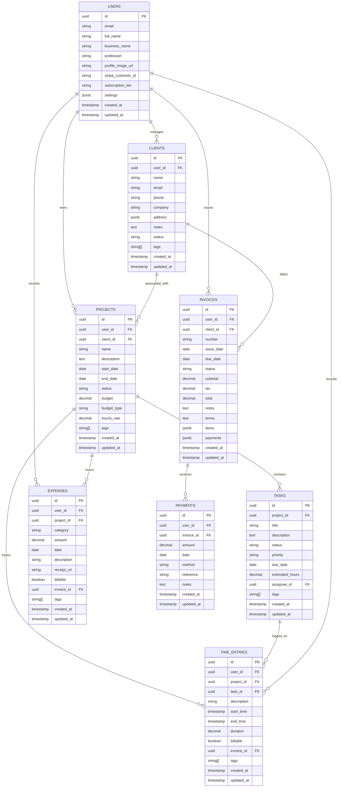
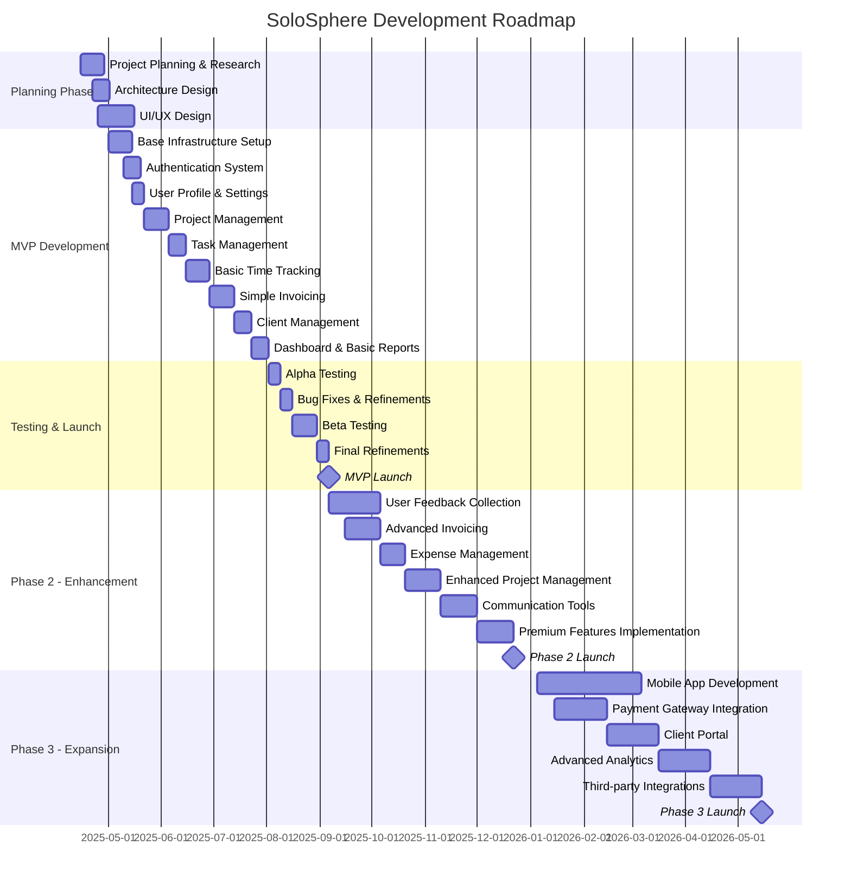
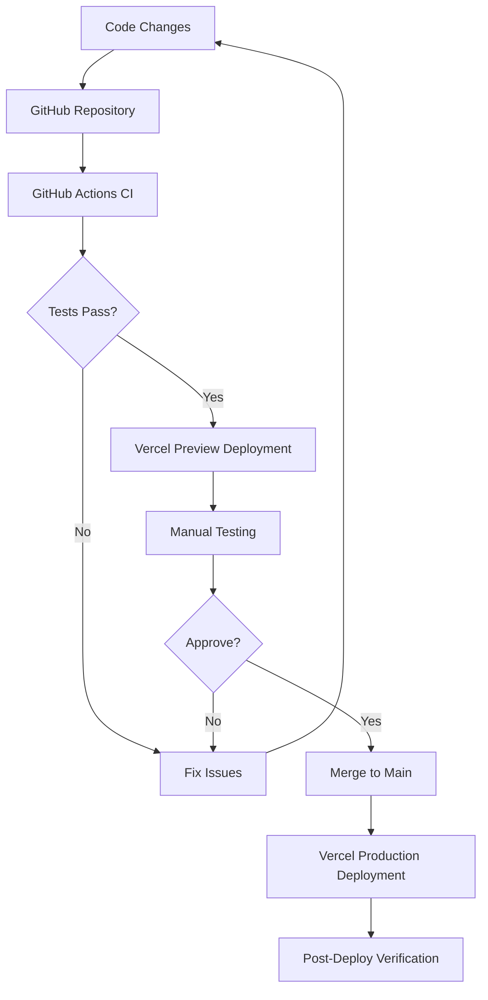
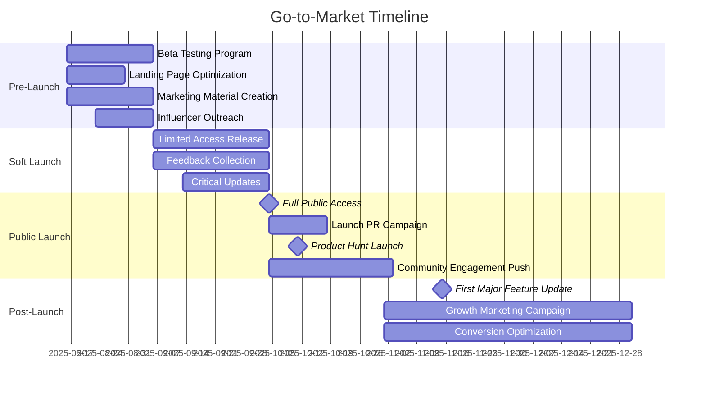

# SoloSphere: Comprehensive Development & Business Plan

## Table of Contents

1. [Project Vision & Overview](#1-project-vision--overview)
2. [Market Analysis](#2-market-analysis)
3. [Product Design](#3-product-design)
4. [Technical Architecture](#4-technical-architecture)
5. [Feature Specifications](#5-feature-specifications)
6. [Development Roadmap](#6-development-roadmap)
7. [Development Process](#7-development-process)
8. [DevOps & Infrastructure](#8-devops--infrastructure)
9. [Monetization Strategy](#9-monetization-strategy)
10. [Go-to-Market Strategy](#10-go-to-market-strategy)
11. [User Acquisition & Growth](#11-user-acquisition--growth)
12. [Legal & Compliance](#12-legal--compliance)
13. [Risk Assessment & Mitigation](#13-risk-assessment--mitigation)
14. [Success Metrics & KPIs](#14-success-metrics--kpis)
15. [Future Vision](#15-future-vision)

---

## 1. Project Vision & Overview

### 1.1 Vision Statement

SoloSphere aims to be the definitive all-in-one business management platform for freelancers and sole traders, eliminating the need for multiple disjointed tools by providing a unified ecosystem that handles every aspect of freelance business operations.

### 1.2 Mission Statement

To empower freelancers and sole traders by simplifying their business operations, reducing administrative overhead, and providing actionable insights that help them focus on their craft, increase profitability, and achieve sustainable growth.

### 1.3 Core Values

1. **Simplicity**: Streamlined workflows that reduce complexity
2. **Integration**: Seamless connection between all business functions
3. **Transparency**: Clear and understandable business metrics
4. **Adaptability**: Flexible tools that adjust to different freelance workflows
5. **Security**: Protection of sensitive business and client data

### 1.4 Project Goals

1. Develop an intuitive platform that combines invoicing, time tracking, project management, and client relationship tools
2. Create a freemium model that offers genuine value at the free tier while incentivizing premium conversion
3. Build a scalable infrastructure that accommodates growth from individual users to potential team expansion
4. Establish SoloSphere as a trusted name in the freelancer tools market

### 1.5 Why SoloSphere Matters

Freelancers and sole traders typically cobble together 5-7 different tools to manage their business operations, leading to:

- Data fragmentation across platforms
- Inefficient time spent switching between tools
- Increased monthly subscription costs
- Disconnected business insights
- Administrative overhead that reduces billable hours

SoloSphere addresses these pain points by providing a unified platform that handles all aspects of freelance business management, ultimately increasing productivity, professionalism, and profitability.

---

## 2. Market Analysis

### 2.1 Target Audience Personas

#### 2.1.1 Creative Freelancer: "Design Dana"

- **Demographics**: 28-40 years old, urban-based
- **Profession**: Graphic designer, illustrator, photographer
- **Income Level**: $50,000-$80,000 annually
- **Pain Points**:
  - Juggles multiple projects with varying deadlines
  - Struggles with consistent invoicing and follow-ups
  - Has difficulty tracking time spent on creative work
  - Needs an organized way to present portfolio and manage client feedback
- **Goals**:
  - Spend more time creating, less time on administration
  - Maintain a professional image with clients
  - Track profitability of different project types

#### 2.1.2 Technical Contractor: "Developer Dave"

- **Demographics**: 25-45 years old, can be remote or office-based
- **Profession**: Web developer, software engineer, IT consultant
- **Income Level**: $70,000-$120,000 annually
- **Pain Points**:
  - Needs detailed time tracking for hourly billing
  - Requires project management tools that integrate with development workflows
  - Struggles with scope creep and project documentation
  - Juggles multiple clients with different communication preferences
- **Goals**:
  - Clear documentation of project scope and deliverables
  - Efficient tracking of development time
  - Professional client communication

#### 2.1.3 Service Provider: "Consultant Carol"

- **Demographics**: 35-55 years old, mix of remote and on-site work
- **Profession**: Business consultant, coach, professional services provider
- **Income Level**: $80,000-$150,000 annually
- **Pain Points**:
  - Needs to track time across multiple client engagements
  - Requires sophisticated scheduling and appointment tools
  - Has complex proposal and contract requirements
  - Needs to demonstrate value through reporting
- **Goals**:
  - Streamline client onboarding and engagement management
  - Create consistent, professional documentation
  - Track profitability by client and service type

#### 2.1.4 Side Hustler: "Part-time Pat"

- **Demographics**: 22-35 years old, primarily working evenings and weekends
- **Profession**: Various side gigs alongside traditional employment
- **Income Level**: $15,000-$30,000 from freelance work annually
- **Pain Points**:
  - Limited time for administrative tasks
  - Needs simple but effective business tools
  - Budget-conscious with tool investments
  - Balancing side work with full-time employment
- **Goals**:
  - Maximize efficiency in limited available time
  - Simple but professional client management
  - Clear financial tracking for tax purposes

### 2.2 Market Size & Opportunity

- **Global Freelancer Population**: 1.1 billion freelancers worldwide (2023)
- **US Freelancer Market**: 70.4 million freelance workers (36% of workforce)
- **European Freelancer Market**: 22 million registered freelancers
- **Annual Growth Rate**: 15% year-over-year growth in freelance population

**Addressable Market Segments**:
- Professional freelancers: 35% of total freelance population
- Side hustlers and part-time freelancers: 40% of total freelance population
- Service-based small businesses: 25% of total freelance population

**Total Addressable Market (TAM)**:
- Assuming a subscription model averaging $15/month for premium features
- Conservatively targeting 2% of the global professional freelancer market
- TAM estimate: $450 million annually

### 2.3 Competitive Analysis

#### 2.3.1 Direct Competitors

| Competitor | Key Features | Strengths | Weaknesses | Pricing Model |
|------------|--------------|-----------|------------|---------------|
| **FreshBooks** | Invoicing, expense tracking, time tracking, project management | Strong accounting features, established brand | Expensive, complex UI, limited project management | $15-$50/month |
| **Bonsai** | Contracts, proposals, invoicing, time tracking | Strong contract/proposal features, freelancer-focused | Limited CRM, no mobile app, project management not robust | $19-$39/month |
| **AND CO** | Invoicing, contracts, expense tracking | Simple UI, good mobile app | Limited project management, basic reporting | $18/month |
| **Plutio** | Project management, CRM, invoicing, time tracking | All-in-one approach, client portal | Complicated UI, performance issues | $15-$30/month |
| **Honeybook** | CRM, invoicing, contracts, client portal | Strong client-focused features | Limited time tracking, not suitable for technical freelancers | $39/month |

#### 2.3.2 Indirect Competitors

| Category | Example Competitors | How They Compete |
|----------|---------------------|------------------|
| **Project Management** | Asana, Trello, ClickUp | Robust project management tools that some freelancers adapt for their workflow |
| **Invoicing Solutions** | Wave, Invoice Ninja | Free/low-cost invoicing-specific tools |
| **Time Tracking** | Toggl, Harvest | Specialized time tracking with limited additional features |
| **CRM Systems** | HubSpot, Pipedrive | Relationship management with potential adaptation for freelance use |

#### 2.3.3 Competitive Advantages

1. **Integrated Experience**: Unlike many competitors that started in one area (invoicing or project management) and added features later, SoloSphere is designed from the ground up as an integrated experience.

2. **Freelancer-First Design**: SoloSphere is built specifically for freelancer workflows, unlike general business tools adapted for freelance use.

3. **Balanced Pricing Strategy**: With a genuinely useful free tier and reasonable premium pricing, SoloSphere avoids the "free but useless" or "overpriced premium" models of many competitors.

4. **Modern Tech Stack**: Utilizing the Next.js and Supabase stack allows for a responsive, modern application that can evolve quickly based on user feedback and scale efficiently.

5. **Mobile-Desktop Parity**: Equal emphasis on mobile and desktop experiences, recognizing that freelancers often work across multiple devices and locations.

### 2.4 Market Trends

1. **Freelance Growth Acceleration**: Post-pandemic growth in freelancing as more professionals seek flexible work arrangements.

2. **Remote Work Normalization**: Clients are increasingly comfortable with remote freelancers, expanding the potential client base.

3. **Tool Consolidation**: Growing fatigue with multiple subscriptions is driving demand for unified tools.

4. **Increased Financial Focus**: Economic uncertainty has heightened freelancers' focus on financial management tools.

5. **Mobile-First Operations**: Increasing number of freelancers managing their business primarily from mobile devices.

6. **AI-Assisted Workflows**: Growing expectation for intelligent assistance in administrative tasks.

7. **Client Collaboration**: Increasing demand for client-facing portals and collaborative tools.

### 2.5 SWOT Analysis

#### Strengths
- Comprehensive feature set addressing multiple freelancer needs
- Modern, responsive technology stack
- Freelancer-specific design philosophy
- Balanced freemium approach

#### Weaknesses
- New entrant in a market with established players
- Limited initial resources for marketing and customer acquisition
- Potential feature complexity balancing simplicity with comprehensiveness

#### Opportunities
- Growing freelance market with increasing demand for consolidated tools
- Dissatisfaction with existing fragmented solutions
- Potential for community building and word-of-mouth growth
- Strategic partnerships with complementary services

#### Threats
- Established competitors with larger marketing budgets
- Potential economic downturns affecting freelancers' tool budgets
- Feature matching by existing tools
- Increasing data privacy regulations

---

## 3. Product Design

### 3.1 Design Philosophy

SoloSphere's design philosophy is built around these core principles:

1. **Contextual Simplicity**: Complex features available when needed, but not cluttering the interface
2. **Task-Based Navigation**: Organizing features around common freelancer tasks rather than technical categories
3. **Progressive Disclosure**: Revealing additional options and complexity as users become more familiar with the system
4. **Consistent Patterns**: Using familiar interaction patterns throughout the application
5. **Glanceable Information**: Key metrics and statuses visible at a glance

### 3.2 User Experience Strategy

#### 3.2.1 User Onboarding Flow

1. **Welcome & Account Creation**: Simple email/password or social auth signup
2. **Profession Selection**: Customizing initial experience based on freelancer type
3. **First Project Creation**: Guided creation of first project to demonstrate core workflow
4. **Data Import Options**: Ability to import clients, projects, or financial data from other systems
5. **Feature Tour**: Interactive walkthrough of key features
6. **First Task Completion**: Guided completion of a common task (creating invoice, tracking time)

#### 3.2.2 Core User Flows

1. **New Client Onboarding**:
   - Client information collection
   - Project setup
   - Contract/agreement creation
   - Initial communication

2. **Project Lifecycle Management**:
   - Project creation and planning
   - Task management and tracking
   - Time tracking
   - Deliverable submission
   - Invoicing
   - Project closure and feedback

3. **Financial Management**:
   - Expense recording
   - Invoice creation
   - Payment tracking
   - Financial reporting

4. **Time Management**:
   - Work session tracking
   - Task time allocation
   - Timesheet review
   - Productivity analysis

### 3.3 UI Design Approach

#### 3.3.1 Design System

A comprehensive design system will be developed including:

- **Color Palette**: Professional, accessible color scheme with primary, secondary, and accent colors
- **Typography**: Readable, professional font hierarchy
- **Component Library**: Reusable UI components with consistent behavior
- **Iconography**: Consistent, intuitive icon set
- **Spacing System**: Standardized spacing for consistent layout
- **Responsive Breakpoints**: Defined breakpoints for various device sizes

#### 3.3.2 Key UI Components

1. **Dashboard**: Customizable overview with key metrics and actionable items
2. **Navigation System**: Contextual navigation that adapts to user workflow
3. **Calendar Views**: For time management and scheduling
4. **Kanban Boards**: For visual project management
5. **Time Tracking Interface**: Simple yet powerful time tracking UI
6. **Invoice Builder**: Visual invoice creation and management
7. **Client Portal**: Professional client-facing interface
8. **Reporting Interface**: Visual data representation and analysis tools

#### 3.3.3 Mobile vs. Desktop Considerations

- **Mobile**: Focus on core actions (time tracking, expense capture, quick updates)
- **Desktop**: Enhanced for complex tasks (invoice creation, detailed reporting, project planning)
- **Responsive Design**: Single codebase with responsive design rather than separate mobile/desktop versions
- **Touch Optimization**: Interface elements properly sized for touch on mobile
- **Offline Capabilities**: Key features functional without constant connectivity

### 3.4 Accessibility Considerations

- **WCAG 2.1 AA Compliance**: As a minimum standard
- **Screen Reader Support**: Proper semantic markup and ARIA attributes
- **Keyboard Navigation**: Complete application usability without mouse
- **Color Contrast**: Meeting minimum 4.5:1 ratio for normal text
- **Text Resizing**: Supporting 200% text size without loss of functionality
- **Reduced Motion**: Options for users sensitive to animation
- **Error Prevention**: Clear error states and recovery options

### 3.5 Design Process

1. **Research Phase**:
   - Competitor UI analysis
   - User interviews with target personas
   - Task analysis for key workflows

2. **Conceptual Design**:
   - Information architecture
   - User flow diagrams
   - Low-fidelity wireframes

3. **Visual Design**:
   - Design system creation
   - High-fidelity mockups
   - Interactive prototypes

4. **Validation**:
   - Usability testing with target users
   - Accessibility audits
   - Performance testing

5. **Implementation**:
   - Developer handoff
   - CSS/component implementation
   - Design QA

6. **Iteration**:
   - Post-launch usability assessment
   - User feedback collection
   - Continuous improvement

---

## 4. Technical Architecture

### 4.1 High-Level Architecture



### 4.2 Technology Stack Details

#### 4.2.1 Frontend Technologies

- **Core Framework**: Next.js (v15+) with React (v19+)
- **State Management**: React Context API and hooks for local state, SWR/React Query for server state
- **API Communication**: SWR for data fetching, caching, and synchronization
- **Styling**: TailwindCSS with a custom design system
- **Form Handling**: React Hook Form with Zod validation
- **Routing**: Next.js App Router with server components
- **Testing**: Jest, React Testing Library, and Playwright
- **Build Tools**: Next.js built-in compiler with Turbopack
- **Analytics**: Vercel Analytics or Google Analytics
- **Monitoring**: Sentry for error tracking

#### 4.2.2 Backend Technologies

- **API Framework**: Next.js API Routes
- **Authentication**: Supabase Auth with social providers
- **Validation**: Zod for type validation and schema validation
- **Database Interface**: Supabase Client SDK
- **File Handling**: Supabase Storage
- **Email Service**: Resend, SendGrid, or Postmark
- **Testing**: Jest with Supertest
- **Documentation**: Next.js API documentation with OpenAPI
- **Logging**: Vercel Logging or custom structured logging

#### 4.2.3 Database Technologies

- **Primary Database**: PostgreSQL (hosted on Supabase)
- **Realtime Capabilities**: Supabase Realtime (PostgreSQL CDC)
- **File Storage**: Supabase Storage (backed by S3)
- **Backup Strategy**: Automated daily backups with point-in-time recovery
- **Database Schema**: Managed with database migrations

#### 4.2.4 DevOps & Infrastructure

- **Hosting**: Vercel for Next.js application
- **Database Hosting**: Supabase for PostgreSQL
- **CI/CD**: GitHub Actions for automated testing, Vercel for deployment
- **Environment Management**: Vercel environments (development, preview, production)
- **Monitoring**: Vercel Analytics and Sentry
- **Security Scanning**: Dependabot for dependency vulnerability scanning

### 4.3 Data Model

#### 4.3.1 Core Entities

1. **Users**
   - Authentication details
   - Personal information
   - Preferences
   - Subscription status

2. **Clients**
   - Contact information
   - Communication history
   - Projects association
   - Financial relationship

3. **Projects**
   - Details and status
   - Tasks and milestones
   - Time entries
   - Financial information
   - Team members (for future expansion)

4. **Tasks**
   - Description and details
   - Status and priority
   - Time estimates and actuals
   - Assignments
   - Dependencies

5. **TimeEntries**
   - Duration and date
   - Project and task association
   - Billable status
   - Notes and categories

6. **Invoices**
   - Client association
   - Line items
   - Payment status
   - Terms and notes
   - Related time entries or projects

7. **Expenses**
   - Amount and date
   - Category and description
   - Project association
   - Receipt attachment
   - Billable status

8. **Payments**
   - Amount and date
   - Invoice association
   - Payment method
   - Transaction details

#### 4.3.2 Schema Design Principles

1. **Relational Structure**: Leveraging PostgreSQL's relational capabilities for proper data modeling
2. **Indexing Strategy**: Thoughtful indexes on commonly queried fields
3. **Foreign Key Constraints**: Ensuring data integrity through proper constraints
4. **Row-Level Security (RLS)**: Implementing Supabase RLS policies for secure multi-tenancy
5. **Soft Deletion**: Using active flags instead of permanent deletion
6. **Audit Trails**: Implementing change tracking with created_at and updated_at timestamps
7. **Schema Evolution**: Database migrations for versioned schema changes

#### 4.3.3 Database Schema Diagram



### 4.4 API Design

#### 4.4.1 API Architecture

- **Next.js API Routes**: File-based routing for API endpoints
- **Server Components**: Leveraging Next.js 13+ Server Component pattern
- **Authentication**: Supabase Auth integration with middleware
- **Rate Limiting**: Built-in rate limiting with Next.js middleware
- **Documentation**: API documentation generated from TypeScript types

#### 4.4.2 Core API Endpoints

| Resource | Endpoint | Methods | Description |
|----------|----------|---------|-------------|
| **Authentication** | /api/auth/signup | POST | User registration |
| | /api/auth/signin | POST | User authentication |
| | /api/auth/signout | POST | User logout |
| | /api/auth/reset-password | POST | Password reset workflow |
| **Users** | /api/users/me | GET, PATCH | Current user profile |
| | /api/users/settings | GET, PATCH | User settings |
| | /api/users/subscription | GET, POST | Subscription management |
| **Clients** | /api/clients | GET, POST | Client collection |
| | /api/clients/[id] | GET, PATCH, DELETE | Single client |
| | /api/clients/[id]/projects | GET | Client's projects |
| **Projects** | /api/projects | GET, POST | Project collection |
| | /api/projects/[id] | GET, PATCH, DELETE | Single project |
| | /api/projects/[id]/tasks | GET | Project's tasks |
| | /api/projects/[id]/time | GET | Project's time entries |
| **Tasks** | /api/tasks | GET, POST | Task collection |
| | /api/tasks/[id] | GET, PATCH, DELETE | Single task |
| | /api/tasks/[id]/time | GET | Task's time entries |
| **Time** | /api/time | GET, POST | Time entry collection |
| | /api/time/[id] | GET, PATCH, DELETE | Single time entry |
| | /api/time/running | GET | Currently running timer |
| | /api/time/start | POST | Start a timer |
| | /api/time/stop | POST | Stop running timer |
| **Invoices** | /api/invoices | GET, POST | Invoice collection |
| | /api/invoices/[id] | GET, PATCH, DELETE | Single invoice |
| | /api/invoices/[id]/send | POST | Send invoice to client |
| | /api/invoices/[id]/payments | GET | Invoice payments |
| **Expenses** | /api/expenses | GET, POST | Expense collection |
| | /api/expenses/[id] | GET, PATCH, DELETE | Single expense |
| **Payments** | /api/payments | GET, POST | Payment collection |
| | /api/payments/[id] | GET, PATCH, DELETE | Single payment |
| **Reports** | /api/reports/time | GET | Time report |
| | /api/reports/finance | GET | Financial report |
| | /api/reports/projects | GET | Project performance |

#### 4.4.3 API Response Format

Standard JSON response format:

```json
{
  "data": { },
  "meta": {
    "pagination": {
      "page": 1,
      "pageSize": 20,
      "total": 45,
      "totalPages": 3
    }
  }
}
```

Error response format:

```json
{
  "error": {
    "code": "RESOURCE_NOT_FOUND",
    "message": "The requested resource was not found",
    "details": { }
  }
}
```

### 4.5 Authentication & Security

#### 4.5.1 Authentication Flow

1. **Registration**:
   - Email verification via Supabase Auth
   - Password strength requirements
   - Prevention of duplicate accounts
   - Social provider options (Google, GitHub)

2. **Login Flow**:
   - Email/password authentication
   - Social authentication (Google, GitHub)
   - Two-factor authentication (premium feature)
   - JWT-based session management via Supabase Auth

3. **Session Management**:
   - Secure, HTTP-only cookies for session management
   - Automatic session refresh
   - Session revocation on logout
   - Client-side session state via React Context

#### 4.5.2 Authorization Strategy

1. **Role-Based Access Control**:
   - User roles in Supabase Auth
   - Feature access based on subscription tier
   - Row-Level Security in Supabase

2. **Resource Authorization**:
   - Owner-based access control via RLS policies
   - Shared resource permissions (future feature)
   - Client portal limited access

#### 4.5.3 Security Measures

1. **Data Protection**:
   - Supabase's built-in at-rest encryption
   - TLS/SSL for data in transit
   - Secure password handling via Supabase Auth
   - PII data minimization

2. **API Protection**:
   - Rate limiting with Next.js middleware
   - CORS configuration
   - Content Security Policy
   - Input validation with Zod

3. **Infrastructure Security**:
   - Regular dependency updates with Dependabot
   - Security headers configuration
   - Logging of security events
   - Regular security audits

### 4.6 Performance Optimization

#### 4.6.1 Frontend Optimization

1. **Next.js Optimizations**:
   - Automatic code splitting
   - Server components for reduced client-side JavaScript
   - Static generation where possible
   - Image optimization with next/image

2. **Rendering Performance**:
   - Selective use of client components
   - React.memo for expensive components
   - Virtualization for long lists
   - Image optimization with responsive sizing

3. **Data Management**:
   - Efficient state management with React Context
   - Optimistic UI updates
   - Proper caching with SWR or React Query
   - Streaming responses for large datasets

#### 4.6.2 Backend Optimization

1. **Database Optimization**:
   - Appropriate indexing strategy in PostgreSQL
   - Query optimization with prepared statements
   - Pagination of large result sets
   - Efficient join strategies

2. **Caching Strategy**:
   - Edge caching with Vercel
   - SWR stale-while-revalidate pattern
   - Response caching where appropriate
   - Redis integration for high-traffic scenarios

3. **API Optimization**:
   - Request batching
   - Incremental Static Regeneration for semi-static data
   - Compression of responses
   - Efficient JSON serialization

#### 4.6.3 Mobile Optimization

1. **Network Efficiency**:
   - Offline-first approach with service workers
   - Data minimization with selective fields
   - Synchronization strategies
   - Progressive loading patterns

2. **Resource Usage**:
   - Battery-conscious implementation
   - Memory leak prevention
   - Background processing limitations
   - Responsive design for all device sizes

---

## 5. Feature Specifications

### 5.1 User Management

#### 5.1.1 User Registration & Authentication

**Description**: Secure registration and authentication system for user accounts.

**User Stories**:
- As a new user, I want to create an account using my email so I can start using the platform
- As a returning user, I want to log in securely to access my account
- As a user, I want to reset my password if I forget it
- As a user, I want to change my password periodically for security

**Technical Requirements**:
- Email verification process
- Password strength enforcement
- Multi-factor authentication (premium)
- Session management
- Account recovery workflow

**Free vs. Premium Features**:
- Free: Basic authentication
- Premium: Multi-factor authentication, enhanced security logs

#### 5.1.2 User Profile Management

**Description**: Comprehensive profile management for freelancer identity and settings.

**User Stories**:
- As a user, I want to update my personal and business information
- As a user, I want to upload a profile photo to personalize my account
- As a user, I want to set my availability hours
- As a user, I want to configure notification preferences

**Technical Requirements**:
- Profile data CRUD operations
- Image upload and processing
- Availability calendar integration
- Notification channel configuration

**Free vs. Premium Features**:
- Free: Basic profile management
- Premium: Multiple business profiles, custom branding

### 5.2 Project & Task Management

#### 5.2.1 Project Management

**Description**: Tools for creating and managing client projects with tracking and organization features.

**User Stories**:
- As a freelancer, I want to create projects for each client engagement
- As a freelancer, I want to set project budgets and track progress against them
- As a freelancer, I want to see all my active projects in one dashboard
- As a freelancer, I want to archive completed projects while maintaining their data

**Technical Requirements**:
- Project CRUD operations
- Budget tracking algorithms
- Status and progress visualization
- Archiving system with data retention

**Free vs. Premium Features**:
- Free: Up to 3 active projects, basic project management
- Premium: Unlimited projects, advanced budget tracking, project templates

#### 5.2.2 Task Management

**Description**: Functionality for breaking projects into manageable tasks with tracking and organization.

**User Stories**:
- As a freelancer, I want to create tasks within my projects
- As a freelancer, I want to prioritize tasks and set deadlines
- As a freelancer, I want to track task status using a kanban-style board
- As a freelancer, I want to set dependencies between tasks

**Technical Requirements**:
- Task CRUD operations
- Priority and deadline system
- Kanban board implementation
- Dependency management logic

**Free vs. Premium Features**:
- Free: Basic task management, single board view
- Premium: Multiple view options (kanban, list, calendar), recurring tasks, subtasks

### 5.3 Time Tracking & Productivity

#### 5.3.1 Time Tracking

**Description**: Tools for tracking billable and non-billable time across projects and tasks.

**User Stories**:
- As a freelancer, I want to track time using a one-click timer
- As a freelancer, I want to manually add time entries for work done offline
- As a freelancer, I want to associate time entries with specific projects and tasks
- As a freelancer, I want to generate timesheets for billing purposes

**Technical Requirements**:
- Real-time timer functionality
- Manual time entry system
- Project/task association logic
- Timesheet generation algorithms

**Free vs. Premium Features**:
- Free: Basic time tracking, limited historical data
- Premium: Advanced time analytics, idle time detection, unlimited history

#### 5.3.2 Productivity Tools

**Description**: Features that enhance productivity and work habits for freelancers.

**User Stories**:
- As a freelancer, I want to use a Pomodoro timer to maintain focus
- As a freelancer, I want to see productivity metrics about my work patterns
- As a freelancer, I want to set work goals and track progress
- As a freelancer, I want to receive notifications for breaks and focus periods

**Technical Requirements**:
- Pomodoro timer implementation
- Productivity analytics algorithms
- Goal tracking system
- Notification scheduling

**Free vs. Premium Features**:
- Free: Basic productivity tools
- Premium: Advanced work pattern analysis, custom work methodologies

### 5.4 Financial Management

#### 5.4.1 Invoicing System

**Description**: Comprehensive invoicing system for billing clients and tracking payments.

**User Stories**:
- As a freelancer, I want to create professional invoices for clients
- As a freelancer, I want to automatically generate invoices from time entries
- As a freelancer, I want to customize invoice templates and branding
- As a freelancer, I want to send reminders for overdue invoices

**Technical Requirements**:
- Invoice generation engine
- PDF generation capabilities
- Time entry integration
- Email notification system for reminders

**Free vs. Premium Features**:
- Free: Basic invoicing, limited to 5 per month
- Premium: Unlimited invoices, custom templates, recurring invoices

#### 5.4.2 Expense Tracking

**Description**: Tools for tracking business expenses with categorization and reporting.

**User Stories**:
- As a freelancer, I want to log business expenses with receipts
- As a freelancer, I want to categorize expenses for tax purposes
- As a freelancer, I want to bill certain expenses to clients
- As a freelancer, I want to generate expense reports for accounting

**Technical Requirements**:
- Expense CRUD operations
- Receipt image processing
- Category management system
- Report generation

**Free vs. Premium Features**:
- Free: Basic expense tracking
- Premium: OCR receipt scanning, tax category suggestions, advanced reporting

#### 5.4.3 Payment Processing

**Description**: Features for accepting and managing client payments directly through the platform.

**User Stories**:
- As a freelancer, I want clients to pay invoices online
- As a freelancer, I want to accept multiple payment methods
- As a freelancer, I want to automatically record payments against invoices
- As a freelancer, I want to set up recurring payment schedules

**Technical Requirements**:
- Payment gateway integration (Stripe)
- Multiple payment method support
- Automatic reconciliation logic
- Recurring payment scheduling

**Free vs. Premium Features**:
- Free: Manual payment recording
- Premium: Online payment acceptance, recurring billing, reduced transaction fees

### 5.5 Client Relationship Management

#### 5.5.1 Client Database

**Description**: Tools for managing client information and relationship history.

**User Stories**:
- As a freelancer, I want to store client contact information
- As a freelancer, I want to track communication history with clients
- As a freelancer, I want to organize clients with tags and categories
- As a freelancer, I want to store client-specific notes and documents

**Technical Requirements**:
- Client CRUD operations
- Communication log system
- Tagging and categorization
- Document storage and management

**Free vs. Premium Features**:
- Free: Up to 5 clients, basic information
- Premium: Unlimited clients, detailed relationship tracking

#### 5.5.2 Client Portal

**Description**: Secure portal for clients to view projects, approve deliverables, and pay invoices.

**User Stories**:
- As a freelancer, I want to give clients limited access to their projects
- As a freelancer, I want clients to approve work and provide feedback
- As a freelancer, I want clients to view and pay invoices online
- As a freelancer, I want to maintain a professional branded experience for clients

**Technical Requirements**:
- Secure client authentication
- Limited-access permission system
- Approval workflow implementation
- White-labeling capabilities

**Free vs. Premium Features**:
- Free: Basic client access
- Premium: Custom branded portal, advanced collaboration tools

### 5.6 Communication & Collaboration

#### 5.6.1 Messaging System

**Description**: Internal messaging system for client communication within the platform.

**User Stories**:
- As a freelancer, I want to send messages to clients within the platform
- As a freelancer, I want to share files and documents with messages
- As a freelancer, I want to receive notifications for new messages
- As a freelancer, I want to maintain an organized message history

**Technical Requirements**:
- Real-time messaging system
- File attachment capabilities
- Notification service integration
- Conversation threading

**Free vs. Premium Features**:
- Free: Basic messaging
- Premium: Message templates, scheduling, read receipts

#### 5.6.2 Document Management

**Description**: Tools for managing, sharing, and collaborating on documents with clients.

**User Stories**:
- As a freelancer, I want to store project-related documents
- As a freelancer, I want to share documents with clients securely
- As a freelancer, I want version control for documents
- As a freelancer, I want to receive feedback on documents

**Technical Requirements**:
- Document storage system
- Secure sharing mechanisms
- Version control implementation
- Commenting and feedback system

**Free vs. Premium Features**:
- Free: Basic document storage, limited space
- Premium: Advanced document collaboration, unlimited storage

### 5.7 Reporting & Analytics

#### 5.7.1 Financial Reporting

**Description**: Comprehensive financial reporting tools for business insights.

**User Stories**:
- As a freelancer, I want to see income reports by client and project
- As a freelancer, I want to track outstanding and overdue invoices
- As a freelancer, I want to analyze my expense patterns
- As a freelancer, I want to forecast future income based on current projects

**Technical Requirements**:
- Data aggregation algorithms
- Visualization components
- Forecasting models
- Export functionality

**Free vs. Premium Features**:
- Free: Basic financial summary
- Premium: Detailed financial analysis, forecasting, tax preparation assistance

#### 5.7.2 Time & Productivity Reporting

**Description**: Analytics on time usage and productivity patterns.

**User Stories**:
- As a freelancer, I want to analyze how I spend my working time
- As a freelancer, I want to identify my most productive hours
- As a freelancer, I want to compare billable vs. non-billable time
- As a freelancer, I want to optimize my project time allocations

**Technical Requirements**:
- Time data analysis algorithms
- Productivity pattern recognition
- Comparative analytics
- Recommendation engine

**Free vs. Premium Features**:
- Free: Basic time summary
- Premium: Advanced productivity analysis, optimization recommendations

### 5.8 Mobile Application

#### 5.8.1 Core Mobile Functionality

**Description**: Essential features optimized for mobile devices.

**User Stories**:
- As a freelancer, I want to track time on the go
- As a freelancer, I want to capture expenses with my phone camera
- As a freelancer, I want to check project statuses while away from my desk
- As a freelancer, I want to respond to client messages from my mobile device

**Technical Requirements**:
- Responsive web design implementation
- Camera integration for receipts
- Responsive UI for small screens
- Push notification system

**Free vs. Premium Features**:
- Free: Basic mobile access
- Premium: Full feature parity with desktop

#### 5.8.2 Offline Capabilities

**Description**: Functionality that works without constant internet connectivity.

**User Stories**:
- As a freelancer, I want to track time even without internet access
- As a freelancer, I want to capture expenses offline
- As a freelancer, I want to view critical project information offline
- As a freelancer, I want changes to sync when connectivity is restored

**Technical Requirements**:
- Offline data storage
- Synchronization mechanisms
- Conflict resolution
- Background syncing

**Free vs. Premium Features**:
- Free: Basic offline access
- Premium: Full offline functionality, priority syncing

---

## 6. Development Roadmap

### 6.1 High-Level Timeline



### 6.2 Detailed MVP Development Plan

#### 6.2.1 Sprint 1: Infrastructure & Authentication (Weeks 1-2)

**Objectives**:
- Set up development environment
- Implement base application architecture
- Create authentication system

**Deliverables**:
- Project repository with proper structure
- Development environment configuration
- User registration and login functionality
- Password reset workflow
- Base API structure

#### 6.2.2 Sprint 2: User & Project Management (Weeks 3-4)

**Objectives**:
- Implement user profile management
- Create project management functionality
- Design and implement database schema

**Deliverables**:
- User profile CRUD operations
- Project CRUD operations
- Database models and relationships
- Basic dashboard layout

#### 6.2.3 Sprint 3: Task Management (Weeks 5-6)

**Objectives**:
- Implement task management system
- Create basic kanban board view
- Design task workflow states

**Deliverables**:
- Task CRUD operations
- Kanban board UI implementation
- Task filtering and sorting
- Task status workflow

#### 6.2.4 Sprint 4: Time Tracking (Weeks 7-8)

**Objectives**:
- Implement time tracking core functionality
- Create timer interface
- Build reporting foundations

**Deliverables**:
- Time entry CRUD operations
- Timer start/stop functionality
- Manual time entry interface
- Basic time reports

#### 6.2.5 Sprint 5: Invoicing (Weeks 9-10)

**Objectives**:
- Implement basic invoicing system
- Create invoice generation from time entries
- Build invoice management interface

**Deliverables**:
- Invoice CRUD operations
- Invoice generation from time entries
- Invoice PDF export
- Basic invoice list and detail views

#### 6.2.6 Sprint 6: Client Management (Weeks 11-12)

**Objectives**:
- Implement client management system
- Create client profile views
- Build client relationship tracking

**Deliverables**:
- Client CRUD operations
- Client detail views
- Project-client associations
- Basic client dashboard

#### 6.2.7 Sprint 7: Dashboard & Refinement (Weeks 13-14)

**Objectives**:
- Implement main dashboard views
- Refine existing features
- Prepare for alpha testing

**Deliverables**:
- Main dashboard with key metrics
- Navigation improvements
- Performance optimizations
- Alpha testing preparation

#### 6.2.8 Sprint 8: Testing & Launch Preparation (Weeks 15-16)

**Objectives**:
- Conduct thorough testing
- Fix identified bugs
- Prepare launch infrastructure

**Deliverables**:
- Testing report with resolved issues
- Production deployment configuration
- Launch checklist completion
- MVP launch preparation

### 6.3 Post-MVP Development Focus

#### 6.3.1 Phase 2 Priorities (Months 5-8)

1. **Enhanced Financial Tools**
   - Advanced invoicing with templates
   - Recurring invoices
   - Expense tracking and management
   - Financial dashboard improvements

2. **Communication Enhancements**
   - In-app messaging system
   - Email integration
   - Document sharing
   - Comment threads

3. **Advanced Project Management**
   - Project templates
   - Gantt chart views
   - Resource allocation
   - Advanced reporting

4. **Premium Features Implementation**
   - Subscription management
   - Feature gating
   - Premium onboarding experience

#### 6.3.2 Phase 3 Priorities (Months 9+)

1. **Mobile Application**
   - Progressive Web App implementation
   - Core feature parity
   - Offline capabilities
   - Mobile-specific enhancements

2. **Client Portal**
   - Secure client access
   - Approval workflows
   - Payment capabilities
   - Branded experience

3. **Integration Ecosystem**
   - Accounting software integrations
   - Calendar integrations
   - File storage integrations
   - API for third-party developers

4. **Advanced Analytics**
   - Business intelligence dashboard
   - Predictive analytics
   - Custom reporting
   - Data export capabilities

---

## 7. Development Process

### 7.1 Development Methodology

SoloSphere will be developed using an **Agile methodology with a lean approach**, specifically tailored for an indie developer:

- **Two-Week Sprints**: Fixed duration sprints with defined goals
- **Minimum Viable Increments**: Each sprint delivers working functionality
- **Continuous Testing**: Test-driven development where appropriate
- **User Feedback Integration**: Regularly incorporating early user feedback
- **Flexible Prioritization**: Ability to re-prioritize based on learnings

### 7.2 Code Standards & Conventions

#### 7.2.1 JavaScript/TypeScript Conventions

- **Naming Conventions**: camelCase for variables/functions, PascalCase for classes/components
- **Code Formatting**: Prettier for automatic formatting
- **Linting**: ESLint with appropriate rule sets
- **Documentation**: JSDoc comments for functions and complex logic
- **Component Structure**: Function components with hooks, logical organization

#### 7.2.2 Git Workflow

- **Branch Strategy**: Feature branches from development branch
- **Commit Conventions**: Semantic commit messages
- **Pull Requests**: Self-review before merging
- **Version Tagging**: Semantic versioning for releases

#### 7.2.3 Testing Approach

- **Unit Testing**: Jest for isolated function testing
- **Component Testing**: React Testing Library for component behavior
- **API Testing**: Supertest for endpoint validation
- **End-to-End Testing**: Playwright for critical user flows
- **Test Coverage**: Minimum 70% coverage for critical code paths

### 7.3 Documentation

#### 7.3.1 Code Documentation

- **README Files**: Purpose and usage instructions
- **Code Comments**: Explain "why" not "what"
- **API Documentation**: OpenAPI/Swagger for endpoint documentation
- **Architecture Documentation**: Key decisions and patterns

#### 7.3.2 User Documentation

- **In-App Help**: Contextual help and tooltips
- **Knowledge Base**: Self-service support articles
- **Video Tutorials**: Guided walkthroughs of key features
- **FAQ Section**: Common questions and troubleshooting

### 7.4 Quality Assurance

#### 7.4.1 Testing Strategy

- **Continuous Testing**: Tests run on each commit
- **Manual Testing Checklist**: Key functionality verification
- **Regression Testing**: Ensuring new features don't break existing ones
- **Cross-Browser/Device Testing**: Compatibility verification

#### 7.4.2 Bug Management

- **Bug Tracking**: GitHub Issues with templates
- **Severity Classification**: Critical, major, minor categorization
- **Reproduction Steps**: Detailed steps to reproduce issues
- **Fix Verification**: Confirmation process for bug fixes

### 7.5 Continuous Integration/Deployment

- **CI Pipeline**: GitHub Actions for automated testing
- **Deployment Process**: Automated Vercel deployments with preview environments
- **Environment Strategy**: Development, preview, production environments
- **Monitoring Integration**: Error tracking post-deployment

---

## 8. DevOps & Infrastructure

### 8.1 Hosting Infrastructure

Given the indie developer context and modern cloud platforms, SoloSphere will utilize a serverless architecture optimized for simplicity and cost-effectiveness:

#### 8.1.1 Application Hosting

- **Primary Platform**: Vercel
- **Benefits**:
  - Optimized for Next.js applications
  - Automatic preview deployments for branches
  - Global CDN included
  - Simple CI/CD integration
  - Generous free tier for early stages
  - Serverless functions for API routes

#### 8.1.2 Database Hosting

- **Primary Platform**: Supabase
- **Benefits**:
  - Managed PostgreSQL service
  - Built-in authentication system
  - Row-level security for multi-tenancy
  - Realtime capabilities
  - File storage solution
  - Free tier for development

#### 8.1.3 File Storage

- **Primary Platform**: Supabase Storage
- **Benefits**:
  - Integrated with the database
  - Security rules for access control
  - Image transformations
  - CDN delivery

#### 8.1.4 Email Service

- **Primary Platform**: Resend or SendGrid
- **Benefits**:
  - Reliable email delivery
  - Template management
  - Delivery tracking
  - Free tier for low volumes

### 8.2 Deployment Pipeline



#### 8.2.1 Continuous Integration

- **Code Linting**: Automated style and quality checks
- **Unit Tests**: Core function validation
- **Integration Tests**: API and component interaction testing
- **Type Checking**: TypeScript validation
- **Build Verification**: Ensuring application builds correctly

#### 8.2.2 Deployment Process

- **Preview Deployments**: Automatic for pull requests
- **Production Deployment**: Automatic on main branch changes
- **Rollback Capability**: Instant reversion to previous versions
- **Database Migrations**: Versioned schema changes

### 8.3 Monitoring & Maintenance

#### 8.3.1 Application Monitoring

- **Error Tracking**: Sentry for real-time error monitoring
- **Performance Monitoring**: Vercel Analytics
- **Usage Analytics**: Simple analytics for user behavior
- **Health Checks**: Endpoint monitoring

#### 8.3.2 Maintenance Procedures

- **Dependency Updates**: Regular security and feature updates with Dependabot
- **Database Maintenance**: Index optimization, data integrity checks
- **Backup Procedures**: Automated backups with Supabase
- **Disaster Recovery**: Documented recovery process

### 8.4 Scaling Strategy

The architecture is designed to scale gracefully as user base grows:

#### 8.4.1 Frontend Scaling

- **CDN Utilization**: Global content delivery with Vercel
- **Edge Functions**: Computation at the edge for reduced latency
- **Static Generation**: Pre-rendering where possible
- **Incremental Static Regeneration**: Periodic rebuilds of static content

#### 8.4.2 Backend Scaling

- **Serverless Functions**: Automatic scaling with Next.js API routes
- **Database Scaling**: Supabase managed database scaling
- **Connection Pooling**: Efficient database connections
- **Rate Limiting**: Protection against traffic spikes

#### 8.4.3 Cost Management

- **Resource Monitoring**: Tracking usage patterns
- **Tier Optimization**: Right-sizing service plans
- **Efficient Querying**: Minimizing database operations
- **Caching Strategy**: Reducing redundant computations

---

## 9. Monetization Strategy

### 9.1 Freemium Model Design

SoloSphere will implement a carefully balanced freemium model that provides genuine value at the free tier while creating clear incentives for premium upgrades.

#### 9.1.1 Free Tier Specifications

- **User Limits**: Single user
- **Project Limits**: Maximum of 3 active projects
- **Client Limits**: Maximum of 5 clients
- **Invoice Limits**: 5 invoices per month
- **Storage Limits**: 500MB document storage
- **Feature Limitations**:
  - Basic dashboard only
  - Limited reporting
  - Standard templates only
  - Manual time entry only (no timer)
  - Basic task management

**Strategy**: The free tier is designed to be genuinely useful for freelancers just starting out or those with very limited client work. It provides enough functionality to demonstrate value while creating natural upgrade paths as the freelancer's business grows.

#### 9.1.2 Premium Tier Specifications

- **User Limits**: Single user (team expansion in future)
- **Project Limits**: Unlimited projects
- **Client Limits**: Unlimited clients
- **Invoice Limits**: Unlimited invoices
- **Storage Limits**: 10GB document storage
- **Additional Features**:
  - Advanced reporting and analytics
  - Custom invoice and document templates
  - Client portal access
  - Timer and advanced time tracking
  - Expense tracking and management
  - Recurring invoices
  - Online payment acceptance
  - Kanban and Gantt views
  - Mobile app access
  - Priority support

**Strategy**: The premium tier removes all meaningful limitations and adds significant productivity and professional features that directly contribute to business growth and efficiency.

### 9.2 Pricing Strategy

#### 9.2.1 Price Positioning

- **Free Tier**: $0/month
- **Premium Tier**: $15/month (billed monthly) or $144/year ($12/month, billed annually)

This pricing is strategically positioned:
- Below most direct competitors ($19-50/month)
- Above simple single-purpose tools ($5-10/month)
- Optimized for perceived value vs. feature set
- Affordable for early-career freelancers

#### 9.2.2 Pricing Psychology

- **Annual Discount**: 20% savings encourages longer commitment
- **Value Framing**: Emphasis on time saved and increased professionalism
- **ROI Calculation**: Marketing highlights how one additional billable hour per month covers the subscription cost
- **Transparent Pricing**: No hidden fees or complicated tiers

### 9.3 Payment Processing

- **Primary Provider**: Stripe for subscription and one-time payments
- **Supported Methods**: Credit/debit cards, ACH, Apple Pay, Google Pay
- **Billing Cycles**: Monthly and annual options
- **Trial Period**: 14-day full-access trial (no credit card required)
- **Grace Period**: 7-day grace period for failed payments before limiting access

### 9.4 Conversion Strategy

#### 9.4.1 Free-to-Premium Conversion Tactics

- **Usage-Based Prompts**: Notifications when approaching free tier limits
- **Feature Discovery**: Highlighting premium features within context
- **Success Templates**: Premium templates that show enhanced capabilities
- **Progressive Revelation**: Previews of premium features in free context
- **Seasonal Promotions**: Occasional discounts at key business periods

#### 9.4.2 Retention Strategy

- **Engagement Nurturing**: Regular feature updates and improvements
- **Usage Monitoring**: Proactive support for underutilizing users
- **Renewal Incentives**: Loyalty benefits for long-term subscribers
- **Feedback Integration**: Visible implementation of user suggestions

### 9.5 Future Monetization Opportunities

- **Team Plans**: Expanding to small agency model ($25-40/month)
- **Marketplace**: Template and integration marketplace with revenue sharing
- **White-Label Solution**: For agencies to provide branded client access
- **Enterprise Customization**: Custom development for larger organizations
- **Add-on Services**: Premium integrations or advanced features as separate purchases

---

## 10. Go-to-Market Strategy

### 10.1 Launch Strategy

#### 10.1.1 Soft Launch Phase

- **Duration**: 4 weeks
- **Target Audience**: Small group of beta testers (30-50 users)
- **Objectives**:
  - Identify critical bugs and UX issues
  - Collect initial user feedback
  - Test core functionality in real-world scenarios
  - Refine onboarding process

**Activities**:
- Daily user feedback collection
- Rapid iteration on critical issues
- Usage pattern analysis
- Performance monitoring

#### 10.1.2 Public Launch Phase

- **Duration**: 8 weeks
- **Objectives**:
  - Generate initial user base
  - Establish brand presence
  - Collect diverse usage data
  - Begin conversion optimization

**Launch Activities**:
- Launch announcement on relevant platforms
- Initial content marketing push
- Limited-time launch promotion
- Influencer outreach and demos
- Product Hunt and similar platform launches

### 10.2 Marketing Channels

#### 10.2.1 Content Marketing

- **Blog Strategy**: Weekly articles addressing freelancer pain points
- **Topic Focus**: Time management, invoicing best practices, client relationships
- **SEO Strategy**: Long-tail keywords relevant to freelancer challenges
- **Content Types**: How-to guides, case studies, template resources

#### 10.2.2 Social Media Strategy

- **Primary Platforms**: Twitter, LinkedIn, Instagram
- **Content Mix**:
  - Educational content (40%)
  - Product features (20%)
  - User success stories (20%)
  - Community engagement (20%)
- **Posting Frequency**: 3-5 times per week per platform
- **Community Building**: Active engagement in freelancer conversations

#### 10.2.3 Email Marketing

- **Nurture Sequences**: Tailored onboarding and feature education
- **Newsletter**: Monthly freelancer tips and platform updates
- **Segmentation Strategy**: Based on user behavior and freelancer type
- **Automation Focus**: Behavior-triggered emails for feature discovery

#### 10.2.4 Partnership Marketing

- **Integration Partners**: Cross-promotion with complementary tools
- **Freelance Communities**: Special offers for community members
- **Course Creators**: Tool recommendations in freelance courses
- **Affiliate Program**: Commission for successful referrals

### 10.3 Public Relations & Awareness

- **Freelance Publications**: Guest articles and tool features
- **Podcast Circuit**: Appearances on freelancer-focused podcasts
- **Awards & Recognition**: Submission to relevant SaaS and design awards
- **Case Studies**: In-depth success stories with notable freelancers

### 10.4 User Onboarding Strategy

- **Welcome Sequence**: Guided introduction to core features
- **Interactive Tutorials**: Step-by-step guidance for key workflows
- **Progress Tracking**: Completion indicators for setup steps
- **Early Win Focus**: Designing for immediate value demonstration
- **Contextual Help**: In-app guidance at potential friction points

### 10.5 Launch Timeline



---

## 11. User Acquisition & Growth

### 11.1 Acquisition Channels

#### 11.1.1 Organic Acquisition

- **SEO Strategy**:
  - Focus on long-tail keywords relevant to freelancer pain points
  - Content clusters around key freelancer challenges
  - Technical SEO optimization for performance
  - Regular content publishing schedule

- **Community Engagement**:
  - Active participation in freelancer communities (Reddit, Discord, Facebook Groups)
  - Valuable contributions beyond product promotion
  - AMAs and expert sessions
  - Community-exclusive resources and tools

#### 11.1.2 Paid Acquisition

- **Initial Focus**:
  - Google Ads targeting specific freelancer search terms
  - Limited social media advertising for awareness
  - Retargeting campaigns for website visitors

- **Budget Allocation**:
  - 60% search advertising
  - 25% retargeting
  - 15% social media testing

- **Optimization Metrics**:
  - Cost per trial signup
  - Trial-to-paid conversion rate
  - Overall CAC (Customer Acquisition Cost)

#### 11.1.3 Partnership & Referral

- **Referral Program**:
  - User referral incentives (free months for both parties)
  - Frictionless sharing mechanisms
  - Progress tracking and gamification

- **Strategic Partnerships**:
  - Freelance marketplaces
  - Educational platforms
  - Complementary tools
  - Freelancer communities

### 11.2 Conversion Funnel Optimization

#### 11.2.1 Acquisition to Signup

- **Landing Page Optimization**:
  - Clear value proposition above the fold
  - Social proof integration
  - Simplified signup form
  - Feature preview videos

- **A/B Testing Focus**:
  - Headline variations
  - Call-to-action phrasing
  - Feature highlight ordering
  - Signup form fields

#### 11.2.2 Signup to Activation

- **Activation Definition**: User completes key actions that indicate successful onboarding
  - Creates first project
  - Adds first client
  - Records first time entry
  - Creates first invoice

- **Activation Tactics**:
  - Guided onboarding flow
  - Progress indicators
  - Contextual tips and suggestions
  - Early win celebration

#### 11.2.3 Activation to Conversion

- **Conversion Triggers**:
  - Feature usage limits approach
  - High-value premium feature exposure
  - Success moments (invoice sent, payment received)
  - Business growth indicators

- **Conversion Tactics**:
  - Contextual upgrade prompts
  - Limited-time promotions
  - ROI calculators
  - Friction-free upgrade process

### 11.3 Retention Strategy

#### 11.3.1 Engagement Drivers

- **Regular Value Delivery**:
  - Weekly usage summaries
  - Business insights
  - New feature announcements
  - Seasonal business tips

- **Habit Formation**:
  - Daily usage incentives
  - Streaks and consistency rewards
  - Integration with existing workflows

#### 11.3.2 Churn Prevention

- **Early Warning System**:
  - Declining usage monitoring
  - Engagement scoring
  - Proactive outreach to at-risk users

- **Rescue Campaigns**:
  - Re-engagement emails
  - Special offers for at-risk users
  - Feedback collection for improvement

#### 11.3.3 Long-term Retention

- **Growth-Focused Features**:
  - Business growth tracking
  - Year-over-year comparisons
  - Data portability and exports
  - Advanced customization

- **Community Building**:
  - User spotlights
  - Feature request voting
  - Beta testing opportunities
  - Exclusive content

### 11.4 Growth Metrics & KPIs

#### 11.4.1 Acquisition Metrics

- **Website Traffic**: Visitors per month
- **Signup Rate**: Visitor-to-signup conversion
- **Channel Effectiveness**: CAC by acquisition channel
- **Referral Rate**: Percentage of new users from referrals

#### 11.4.2 Engagement Metrics

- **Activation Rate**: Percentage of new users who complete key actions
- **Feature Adoption**: Usage rates of core features
- **Session Metrics**: Frequency, duration, and depth
- **Stickiness**: DAU/MAU ratio

#### 11.4.3 Revenue Metrics

- **Conversion Rate**: Free-to-paid conversion percentage
- **MRR Growth**: Month-over-month revenue growth
- **ARPU**: Average revenue per user
- **LTV**: Lifetime value of customers
- **LTV:CAC Ratio**: Efficiency of acquisition spending

### 11.5 Growth Experiments

- **Experiment Framework**:
  - Hypothesis-driven testing
  - Measurable success criteria
  - Controlled rollout strategy
  - Analysis and documentation

- **Initial Experiment Areas**:
  - Onboarding optimization
  - Feature discovery improvements
  - Pricing page variations
  - Conversion trigger timing

---

## 12. Legal & Compliance

### 12.1 Legal Documentation

#### 12.1.1 Terms of Service

**Key Components**:
- **User Obligations**: Rules for proper platform use
- **Prohibited Activities**: Clear boundaries on acceptable use
- **Intellectual Property Rights**: Ownership of user-generated content
- **Termination Conditions**: Circumstances for account termination
- **Limitation of Liability**: Boundaries of platform responsibility
- **Dispute Resolution**: Process for handling disagreements

**Implementation Strategy**:
- Professional legal review
- Plain language summaries
- Version control and change notifications
- Accessible format and placement

#### 12.1.2 Privacy Policy

**Key Components**:
- **Data Collection**: What information is gathered and how
- **Data Usage**: How collected information is used
- **Data Sharing**: Circumstances for sharing with third parties
- **User Rights**: Control over personal information
- **Data Security**: Protection measures
- **Cookies & Tracking**: Transparency about monitoring
- **International Data Transfers**: Cross-border data handling

**Implementation Strategy**:
- GDPR and CCPA compliance
- Regular policy reviews
- User-friendly data control center
- Transparent communication about changes

### 12.2 Data Protection & Privacy

#### 12.2.1 GDPR Compliance

- **Data Minimization**: Collecting only necessary information
- **Purpose Limitation**: Using data only for stated purposes
- **User Rights Implementation**:
  - Right to access
  - Right to rectification
  - Right to erasure
  - Right to data portability
- **Consent Management**: Clear, affirmative consent processes
- **Records of Processing**: Documentation of data handling
- **Data Protection Impact Assessment**: For high-risk processing

#### 12.2.2 Data Security Measures

- **Encryption**: Data encryption at rest and in transit
- **Access Controls**: Role-based permissions
- **Authentication Security**: Strong password policies, MFA
- **Regular Audits**: Security testing and vulnerability assessments
- **Incident Response Plan**: Procedures for potential data breaches
- **Vendor Security Assessment**: Third-party service evaluation

### 12.3 Financial Compliance

#### 12.3.1 Payment Processing

- **PCI DSS Compliance**: For handling payment information
- **Payment Processor Selection**: Using compliant providers (Stripe)
- **Financial Data Handling**: Minimizing direct contact with financial details
- **Transaction Records**: Maintaining proper documentation

#### 12.3.2 Tax Considerations

- **Sales Tax Collection**: For applicable jurisdictions
- **VAT Handling**: For European customers
- **Tax Documentation**: Proper invoicing for tax purposes
- **Financial Reporting**: Accurate record-keeping

### 12.4 Intellectual Property

- **Trademark Registration**: For SoloSphere name and logo
- **Copyright Notices**: Proper attribution on created materials
- **Open Source Compliance**: License adherence for third-party components
- **IP Infringement Process**: Procedure for handling claims

### 12.5 Compliance Monitoring & Maintenance

- **Regular Legal Reviews**: Quarterly assessment of changing regulations
- **Compliance Calendar**: Tracking of reporting requirements
- **Documentation Updates**: Regular revision of legal documents
- **Staff Training**: Awareness of compliance requirements
- **Audit Trails**: Record-keeping for compliance verification

---

## 13. Risk Assessment & Mitigation

### 13.1 Technical Risks

| Risk | Probability | Impact | Mitigation Strategy |
|------|------------|--------|---------------------|
| **Security Breach** | Medium | High | - Regular security audits<br>- Dependency vulnerability scanning<br>- Secure coding practices<br>- Limited data retention |
| **Performance Issues** | Medium | Medium | - Performance testing during development<br>- Scalable architecture design<br>- Monitoring and alerting<br>- Optimization plan for high-load areas |
| **Data Loss** | Low | High | - Regular automated backups<br>- Point-in-time recovery<br>- Disaster recovery procedures<br>- Data integrity validation |
| **Third-Party Service Failures** | Medium | Medium | - Service redundancy where critical<br>- Fallback mechanisms<br>- Monitoring of external dependencies<br>- Clear incident response plan |
| **Technical Debt Accumulation** | High | Medium | - Regular refactoring sessions<br>- Code quality metrics<br>- Architecture reviews<br>- Documentation requirements |

### 13.2 Business Risks

| Risk | Probability | Impact | Mitigation Strategy |
|------|------------|--------|---------------------|
| **Low User Adoption** | Medium | High | - Early beta testing<br>- Continuous user feedback<br>- Feature prioritization based on user needs<br>- Flexible roadmap |
| **Competitor Response** | Medium | Medium | - Unique value proposition emphasis<br>- Rapid iteration capability<br>- Community building focus<br>- Pricing strategy flexibility |
| **Pricing Model Failure** | Medium | High | - Continuous conversion analysis<br>- A/B testing of pricing structure<br>- Value-based pricing approach<br>- Early adopter feedback |
| **Regulatory Changes** | Medium | Medium | - Regular compliance monitoring<br>- Conservative interpretation of regulations<br>- Advisory relationship with legal counsel<br>- Adaptable data handling practices |
| **Resource Constraints** | High | Medium | - Prioritization framework<br>- MVP approach with incremental development<br>- Strategic outsourcing for specialists<br>- Efficient development practices |

### 13.3 Market Risks

| Risk | Probability | Impact | Mitigation Strategy |
|------|------------|--------|---------------------|
| **Market Saturation** | Medium | Medium | - Clear differentiation strategy<br>- Niche focus initially<br>- Strong branding<br>- Superior user experience |
| **Changing User Needs** | Medium | Medium | - Continuous user research<br>- Feature usage monitoring<br>- Adaptable product roadmap<br>- Feedback channels |
| **Economic Downturn** | Medium | Medium | - Value-oriented messaging<br>- Flexible pricing options<br>- Cost efficiency focus<br>- ROI demonstration |
| **New Technology Disruption** | Low | High | - Technology trend monitoring<br>- Modular architecture for adaptation<br>- Innovation budget allocation<br>- Strategic partnerships |
| **Platform Dependency** | Medium | Medium | - Cross-platform compatibility<br>- Portable codebase<br>- Abstraction layers for services<br>- Diverse acquisition channels |

### 13.4 Risk Monitoring

- **Risk Register**: Maintained and reviewed quarterly
- **Key Risk Indicators**: Metrics for early warning
- **Incident Response Plan**: Procedures for risk materialization
- **Post-Mortem Analysis**: Learning from occurrences
- **Stakeholder Communication**: Transparency about significant risks

---

## 14. Success Metrics & KPIs

### 14.1 User Growth Metrics

- **User Acquisition Rate**: New signups per month
- **User Activation Rate**: Percentage completing key setup actions
- **Active User Metrics**:
  - Daily Active Users (DAU)
  - Weekly Active Users (WAU)
  - Monthly Active Users (MAU)
- **Stickiness Ratio**: DAU/MAU
- **Retention Cohorts**: User retention by acquisition period

**Targets**:
- Month 3: 500 registered users, 40% activation rate
- Month 6: 2,000 registered users, 50% activation rate
- Month 12: 10,000 registered users, 60% activation rate

### 14.2 Engagement Metrics

- **Feature Adoption**: Percentage using each core feature
- **Usage Frequency**: Average sessions per user per week
- **Session Metrics**: Duration, depth, feature interaction
- **Content Engagement**: Documentation and help resource usage
- **User Satisfaction**: NPS and satisfaction surveys

**Targets**:
- Month 3: 3 average weekly sessions, 30% using 3+ features
- Month 6: 4 average weekly sessions, 40% using 3+ features
- Month 12: 5 average weekly sessions, 50% using 3+ features

### 14.3 Financial Metrics

- **Conversion Rate**: Free to paid conversion percentage
- **Monthly Recurring Revenue (MRR)**: Predictable monthly income
- **Average Revenue Per User (ARPU)**: Revenue per paying user
- **Customer Acquisition Cost (CAC)**: Cost to acquire new paying users
- **Customer Lifetime Value (LTV)**: Total value of a customer
- **LTV:CAC Ratio**: Efficiency of acquisition spending
- **Churn Rate**: Monthly user cancellation percentage

**Targets**:
- Month 6: 5% conversion rate, $1,000 MRR, 3% monthly churn
- Month 12: 8% conversion rate, $5,000 MRR, 2% monthly churn
- Month 24: 10% conversion rate, $20,000 MRR, 1.5% monthly churn

### 14.4 Product Quality Metrics

- **Bug Metrics**: Reported issues, resolution time
- **Performance Metrics**: Load times, response times
- **Usability Metrics**: Task completion rates, error rates
- **Support Metrics**: Ticket volume, resolution time
- **System Reliability**: Uptime, error rates

**Targets**:
- 99.9% uptime
- <2 second average page load time
- <24 hour average support resolution time
- <1% critical bug rate per release

### 14.5 Business Performance Dashboard

A comprehensive dashboard will be developed to track all key metrics in real-time, including:

- **Daily Pulse**: Key metrics updated daily
- **Weekly Trends**: Week-over-week performance
- **Monthly Reviews**: Comprehensive monthly analysis
- **Quarterly Strategy**: In-depth quarterly business review

This dashboard will drive data-informed decision making throughout the product lifecycle.

---

## 15. Future Vision

### 15.1 Long-Term Product Vision

SoloSphere aims to evolve beyond a freelancer management tool into a comprehensive business operating system for independent professionals and small teams.

#### 15.1.1 Three-Year Vision

- **Team Collaboration**: Expansion to support small teams and agencies
- **AI-Powered Assistance**: Intelligent automation for administrative tasks
- **Business Intelligence**: Advanced analytics and forecasting
- **Marketplace Ecosystem**: Third-party extensions and templates
- **Client Collaboration**: Enhanced client workspace and communication tools
- **Financial Services**: Integrated banking, accounting, and tax services
- **Knowledge Management**: Project and client knowledge base

#### 15.1.2 Potential Expansion Areas

- **Freelancer Marketplace**: Connecting clients with freelancers
- **Learning & Development**: Skill-building integrated with business tools
- **Business Formation**: Legal and administrative setup for new businesses
- **Global Payments**: Multi-currency and international payment handling
- **Business Financing**: Access to loans and financial services

### 15.2 Technology Evolution

- **AI Integration**: Machine learning for workflow optimization and insights
- **Blockchain Consideration**: For contracts and payment verification
- **API Ecosystem**: Comprehensive API for third-party integration
- **Offline-First Architecture**: Enhanced capabilities without connectivity
- **Voice Interfaces**: Voice commands for hands-free operation

### 15.3 Business Model Evolution

- **Vertical SaaS Approach**: Industry-specific versions with tailored features
- **Service Expansion**: Additional revenue streams beyond subscription
- **Enterprise Offerings**: Customized solutions for larger organizations
- **White-Label Opportunities**: Platform licensing for agencies
- **Geographic Expansion**: Localization for international markets

### 15.4 Exit Strategies

While building for sustainable growth, potential exit paths include:

- **Acquisition**: By larger SaaS platform seeking freelancer market entry
- **Merger**: With complementary freelancer tools
- **Investment**: Growth capital for accelerated expansion
- **Sustainable Bootstrapping**: Continued independent growth

---

This comprehensive plan provides a detailed blueprint for developing and growing SoloSphere from initial concept through multiple stages of evolution. It addresses product, technical, business, and market considerations while establishing clear paths for execution and measurement of success.