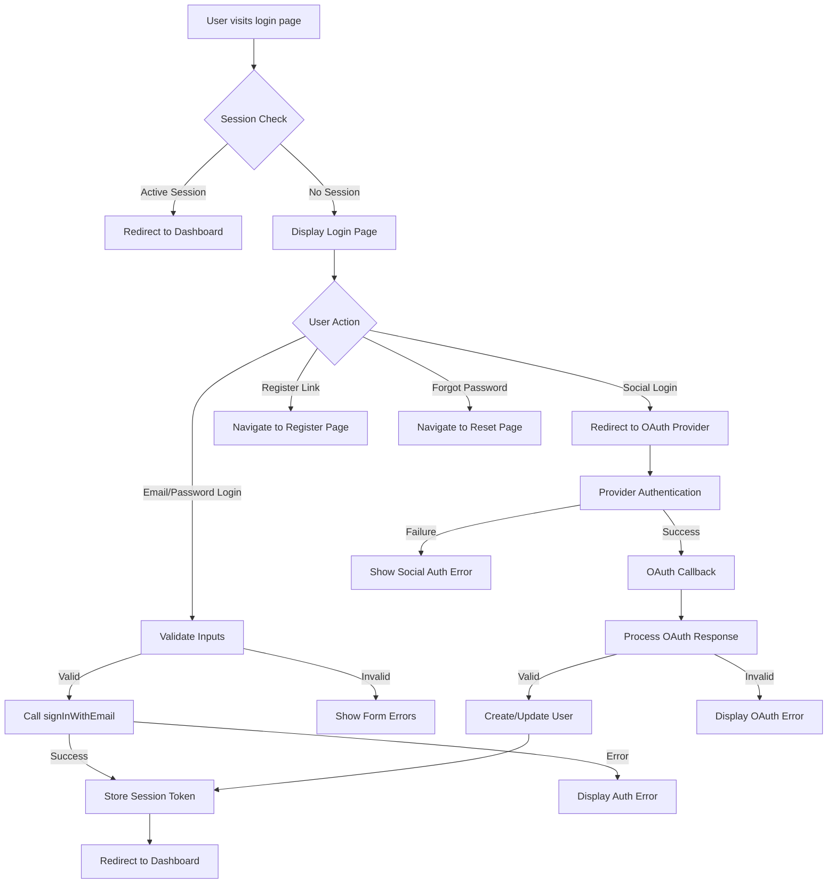

# SoloSphere Login Page Implementation Plan

## Table of Contents
1. [Overview](#overview)
2. [Project Structure](#project-structure)
3. [Authentication Flow](#authentication-flow)
4. [Visual Design Specifications](#visual-design-specifications)
5. [Component Implementation](#component-implementation)
6. [Responsive Design Approach](#responsive-design-approach)
7. [Implementation Steps](#implementation-steps)
8. [Task Breakdown by Role](#task-breakdown-by-role)
9. [Modularity and Reusability](#modularity-and-reusability)
10. [Future Features](#future-features)

## Overview

This document outlines the implementation plan for the SoloSphere login page. The design follows a modern split-screen layout with a form on one side and professional imagery on the other. The login page will support both email/password authentication and social login options (Google, Meta, LinkedIn).

The implementation will use Next.js, React, Tailwind CSS, and Supabase for authentication, aligning with the project's existing technology stack. The design will be responsive, modular, and follow best practices for accessibility and security.

## Project Structure

```
src/
├── app/
│   ├── (auth)/               # Auth group route
│   │   ├── login/            # Login page route
│   │   │   └── page.tsx      # Login page component
│   │   ├── register/         # Registration page route
│   │   │   └── page.tsx      # Registration page component
│   │   ├── forgot-password/  # Password recovery route
│   │   │   └── page.tsx      # Password recovery component
│   │   ├── callback/         # OAuth callback handler
│   │   │   └── route.ts      # API route for OAuth callbacks
│   │   └── layout.tsx        # Shared layout for auth pages
│   └── ...
├── components/
│   ├── auth/                 # Auth-related components
│   │   ├── LoginForm.tsx     # Login form component
│   │   ├── SocialLogin.tsx   # Social login buttons
│   │   └── AuthLayout.tsx    # Authentication layout component
│   └── ui/                   # Reusable UI components
│       ├── Button.tsx        # Reusable button component
│       ├── Input.tsx         # Reusable input component
│       ├── Divider.tsx       # Divider with optional text
│       └── ...
├── lib/
│   ├── auth.ts               # Updated auth utilities
│   ├── supabase.ts           # Supabase client
│   └── ...
├── public/
│   ├── images/               # Image assets
│   │   └── freelancer-workspace.jpg # Login background image
│   └── ...
└── ...
```

## Authentication Flow



### Authentication State Management
- Use React's useState and useEffect hooks to manage authentication state
- Implement a global auth context for access throughout the application
- Store JWT in secure HTTP-only cookies for added security
- Include session expiry check and silent refresh mechanism

### Security Considerations
- Implement proper CSRF protection
- Use HTTPS for all authentication requests
- Store authentication tokens securely
- Validate all user inputs
- Implement rate limiting for login attempts

## Visual Design Specifications

### Layout
- Split-screen design with form on left, imagery on right
- Full-height layout with responsive behavior
- Clean, professional aesthetic aligned with SoloSphere brand

### Color Scheme
- Primary Brand Color: `#4F46E5` (Indigo) - For buttons, links, focus states
- Secondary Brand Color: `#10B981` (Emerald) - For success states, accents
- Neutral Dark: `#1E293B` (Slate 800) - For headings, text
- Neutral Light: `#F8FAFC` (Slate 50) - For backgrounds

### Typography
- Headings: Geist Sans, Bold weight
- Body text: Geist Sans, Regular weight
- Button text: Geist Sans, Medium weight
- Monospace elements: Geist Mono

### Imagery
- Professional workspace image showing freelancer environment
- Subtle gradient overlay for text contrast
- SoloSphere branding and tagline overlay

### Component Design
- **Form Fields**: Clean rectangular inputs with subtle borders
- **Buttons**: Primary action button in brand color, secondary/social buttons with outlines
- **Social Login**: Full-width buttons with provider icons and text
- **Error States**: Clear red text messages with appropriate styling
- **Dividers**: Text dividers for visual organization

## Component Implementation

### Reusable Button Component
```typescript
// src/components/ui/Button.tsx
import React from 'react'
import { cva, type VariantProps } from 'class-variance-authority'

const buttonVariants = cva(
  'inline-flex items-center justify-center rounded-md text-sm font-medium transition-colors focus:outline-none focus:ring-2 focus:ring-slate-400 focus:ring-offset-2 disabled:opacity-50 disabled:pointer-events-none',
  {
    variants: {
      variant: {
        default: 'bg-slate-900 text-white hover:bg-slate-800',
        primary: 'bg-indigo-600 text-white hover:bg-indigo-700',
        outline: 'bg-transparent border border-slate-200 hover:bg-slate-100',
        ghost: 'bg-transparent hover:bg-slate-100',
        link: 'bg-transparent underline-offset-4 hover:underline text-slate-900 hover:bg-transparent',
      },
      size: {
        default: 'h-10 py-2 px-4',
        sm: 'h-9 px-2 rounded-md',
        lg: 'h-11 px-8 rounded-md',
      },
      fullWidth: {
        true: 'w-full',
      }
    },
    defaultVariants: {
      variant: 'default',
      size: 'default',
      fullWidth: false,
    },
  }
)

interface ButtonProps 
  extends React.ButtonHTMLAttributes<HTMLButtonElement>,
    VariantProps<typeof buttonVariants> {
  isLoading?: boolean;
}

const Button = React.forwardRef<HTMLButtonElement, ButtonProps>(
  ({ className, variant, size, fullWidth, isLoading, children, ...props }, ref) => {
    return (
      <button
        className={buttonVariants({ variant, size, fullWidth, className })}
        ref={ref}
        disabled={isLoading || props.disabled}
        {...props}
      >
        {isLoading ? (
          <span className="mr-2 h-4 w-4 animate-spin rounded-full border-2 border-current border-t-transparent" />
        ) : null}
        {children}
      </button>
    )
  }
)
Button.displayName = 'Button'

export { Button, buttonVariants }
```

### Reusable Input Component
```typescript
// src/components/ui/Input.tsx
import React from 'react'

interface InputProps extends React.InputHTMLAttributes<HTMLInputElement> {
  label?: string;
  error?: string;
}

const Input = React.forwardRef<HTMLInputElement, InputProps>(
  ({ className, type, label, error, ...props }, ref) => {
    return (
      <div className="space-y-2">
        {label && (
          <label 
            htmlFor={props.id} 
            className="block text-sm font-medium text-gray-700"
          >
            {label}
          </label>
        )}
        <input
          type={type}
          className={`
            block w-full rounded-md border border-gray-300 px-3 py-2 
            shadow-sm placeholder-gray-400
            focus:border-indigo-500 focus:outline-none focus:ring-1 focus:ring-indigo-500
            disabled:cursor-not-allowed disabled:opacity-50
            ${error ? 'border-red-500 focus:border-red-500 focus:ring-red-500' : ''}
            ${className || ''}
          `}
          ref={ref}
          {...props}
        />
        {error && <p className="text-sm text-red-500">{error}</p>}
      </div>
    )
  }
)
Input.displayName = 'Input'

export { Input }
```

### Auth Utilities Enhancement
```typescript
// src/lib/auth.ts (updated file)
import { supabase } from "./supabase"

// Existing functionality
export async function signUpWithEmail(email: string, password: string) {
  return supabase.auth.signUp({ email, password })
}

export async function signInWithEmail(email: string, password: string) {
  return supabase.auth.signInWithPassword({ email, password })
}

export async function signOut() {
  return supabase.auth.signOut()
}

// New functionality
export async function signInWithGoogle() {
  return supabase.auth.signInWithOAuth({
    provider: 'google',
    options: {
      redirectTo: `${window.location.origin}/auth/callback`,
    }
  })
}

export async function signInWithFacebook() {
  return supabase.auth.signInWithOAuth({
    provider: 'facebook',
    options: {
      redirectTo: `${window.location.origin}/auth/callback`,
    }
  })
}

export async function signInWithLinkedIn() {
  return supabase.auth.signInWithOAuth({
    provider: 'linkedin',
    options: {
      redirectTo: `${window.location.origin}/auth/callback`,
    }
  })
}

export async function resetPassword(email: string) {
  return supabase.auth.resetPasswordForEmail(email, {
    redirectTo: `${window.location.origin}/auth/reset-password`,
  })
}

export async function updatePassword(password: string) {
  return supabase.auth.updateUser({ password })
}

export async function getSession() {
  return supabase.auth.getSession()
}

export async function getUser() {
  const { data: { user } } = await supabase.auth.getUser()
  return user
}
```

## Responsive Design Approach

### Mobile-First Strategy
- Develop using mobile-first approach
- Use Tailwind's responsive modifiers for breakpoints
- Test across various device sizes

### Breakpoint Definitions
- **Small (sm)**: >= 640px
- **Medium (md)**: >= 768px 
- **Large (lg)**: >= 1024px
- **Extra Large (xl)**: >= 1280px
- **2x Large (2xl)**: >= 1536px

### Layout Behavior
1. **Mobile Layout (< 768px)**
   - Stack layout (form first, no background image or small banner)
   - Full-width form elements
   - Adjusted spacing for touch targets
   - Centered form content

2. **Tablet Layout (768px - 1023px)**
   - Begin transitioning to split layout
   - Form takes ~60% of width, image ~40%
   - Slightly reduced padding/margins

3. **Desktop Layout (≥ 1024px)**
   - Full split-screen experience
   - 50/50 layout for form and image
   - Enhanced typography and spacing

## Implementation Steps

### Step 1: Configure Supabase for OAuth Providers
1. Log into Supabase Dashboard
2. Navigate to Authentication > Providers
3. Enable Email/Password provider
4. Enable and configure Google, Facebook, and LinkedIn providers
   - Set up developer accounts for each provider
   - Configure redirect URLs
   - Set API keys and secrets in Supabase
5. Add callback URL: `https://yourdomain.com/auth/callback`

### Step 2: Create Directory Structure and Components
1. Create auth route group and pages
   ```bash
   mkdir -p src/app/(auth)/login
   mkdir -p src/app/(auth)/register
   mkdir -p src/app/(auth)/forgot-password
   mkdir -p src/app/(auth)/callback
   ```

2. Create UI components
   ```bash
   mkdir -p src/components/ui
   mkdir -p src/components/auth
   ```

3. Prepare image assets
   ```bash
   mkdir -p public/images
   ```

### Step 3: Implement Basic Components 
1. Button component
2. Input component
3. Divider component
4. Update auth utilities

### Step 4: Implement Social Login Component
1. Create social login buttons with icons
2. Add OAuth provider integration
3. Add loading states and error handling

### Step 5: Implement Login Page
1. Create the login form
2. Add form validation
3. Add responsive layouts
4. Implement error handling
5. Add social login integration

### Step 6: Implement OAuth Callback Route
1. Create route handler
2. Add authentication exchange logic 
3. Implement redirect after successful login

### Step 7: Testing
1. Test email/password login
2. Test social login providers
3. Test responsive layouts
4. Test error handling
5. Test accessibility compliance

## Task Breakdown by Role

### Frontend Developer
- **Tasks:**
  - Create reusable UI components (Button, Input, Divider)
  - Implement responsive login page layout
  - Create social login component with icons
  - Add form validation and error handling
  - Implement loading states and transitions
  - Build responsive design across breakpoints
  - Ensure accessibility compliance (ARIA, keyboard navigation)

- **Technical Requirements:**
  - Next.js and React expertise
  - Tailwind CSS skills
  - Form handling with React
  - Understanding of responsive design principles
  - Component architecture experience

### Backend Developer
- **Tasks:**
  - Configure Supabase authentication settings
  - Enhance authentication utility functions
  - Implement OAuth callback route handler
  - Set up session management
  - Configure security measures (CSRF protection, secure cookies)
  - Implement error handling for authentication flows

- **Technical Requirements:**
  - Supabase or similar authentication system experience
  - NextJS API routes knowledge
  - Understanding of OAuth flows
  - Security best practices for authentication

### Designer
- **Tasks:**
  - Select/create professional business imagery for login page
  - Create/source social login icons
  - Define exact color values and typography styles
  - Review implementation for visual consistency
  - Ensure proper visual hierarchy in the layout

- **Technical Requirements:**
  - UI/UX design skills
  - Understanding of responsive design principles
  - Knowledge of accessibility best practices
  - Experience with professional imagery selection

### DevOps Engineer
- **Tasks:**
  - Configure environment variables for Supabase
  - Set up proper deployment configurations
  - Ensure HTTPS is properly configured
  - Verify security settings in production environment

- **Technical Requirements:**
  - Experience with Vercel or similar hosting platforms
  - Knowledge of environment configuration
  - Security best practices for web applications
  - SSL/TLS configuration experience

### QA Tester
- **Tasks:**
  - Test authentication flows (email/password, social logins)
  - Verify responsive behavior across device sizes
  - Conduct accessibility testing
  - Test error scenarios and recovery
  - Verify security of authentication implementation

- **Technical Requirements:**
  - Web application testing experience
  - Knowledge of authentication testing
  - Cross-browser and responsive testing skills
  - Accessibility testing experience

## Modularity and Reusability

Modularity and reusability are core principles of this implementation. Components, functions, and design patterns should be built to be reused throughout the application, not just for the login page.

### Component Reusability

1. **UI Component Library**
   - All UI components (Button, Input, Divider, etc.) are built as self-contained, composable units
   - Components accept standardized props for consistent behavior and styling
   - Each component has clear documentation of props, variants, and usage examples
   - Components are designed for context independence, allowing them to work in various parts of the application

2. **Authentication Components**
   - SocialLogin component designed to be used in multiple authentication flows (login, registration)
   - Form handling logic abstracted to be reusable across auth forms
   - Error handling patterns consistent across authentication flows

3. **Layout Components**
   - Split-screen layout component reusable for other marketing or onboarding pages
   - Form container components designed for reuse in multiple forms
   - Responsive behavior implemented at the component level for consistent adaptation

### Code Reusability

1. **Authentication Utilities**
   - Auth functions designed to be called from any part of the application
   - Consistent error handling and return types
   - Provider-agnostic where possible (allowing for future auth providers)

2. **Styling Patterns**
   - Common styling patterns extracted to Tailwind utilities or component variants
   - Consistent class naming conventions
   - Use of Tailwind's configuration for brand colors and design tokens

3. **Form Handling Patterns**
   - Form validation logic structured for reuse
   - Common input types (email, password) have consistent validation rules
   - Error presentation standardized across forms

### Implementation Guidelines for Reusability

1. **Component Design Principles**
   - Components should have a single responsibility
   - Props should have sensible defaults
   - Components should be tested in isolation
   - Components should handle their own state where appropriate

2. **Documentation Standards**
   - Each reusable component should have props documentation
   - Usage examples should be provided
   - State management approaches should be documented
   - Accessibility considerations should be noted

3. **Code Organization**
   - Group related components in logical directories
   - Use index files to simplify imports
   - Maintain consistent file naming conventions
   - Use TypeScript interfaces for prop types

By focusing on modularity and reusability, the login implementation will not only serve its immediate purpose but will also contribute to a consistent, maintainable codebase that allows for rapid development of additional features with similar patterns.

## Future Features

### Login Background Customization

#### Overview
Allow users to upload and set a custom image for their SoloSphere login screen, enhancing brand identity for freelancers and small businesses.

#### Technical Requirements
1. User settings page with image upload capability
2. Image processing to optimize for display (resizing, compression)
3. Storage solution for user-uploaded images
4. Ability to reset to default image
5. Preview capability before saving

#### Database Schema Update
```sql
CREATE TABLE public.user_settings (
  id UUID REFERENCES auth.users(id) PRIMARY KEY,
  login_background_url TEXT,
  login_background_name TEXT,
  created_at TIMESTAMP WITH TIME ZONE DEFAULT NOW(),
  updated_at TIMESTAMP WITH TIME ZONE DEFAULT NOW()
);

-- RLS Policy
ALTER TABLE public.user_settings ENABLE ROW LEVEL SECURITY;
CREATE POLICY "Users can view only their own settings" ON public.user_settings 
  FOR SELECT USING (auth.uid() = id);
CREATE POLICY "Users can update only their own settings" ON public.user_settings 
  FOR UPDATE USING (auth.uid() = id);
```

#### Implementation Timeline:
1. Create custom image upload UI
2. Implement backend storage and processing
3. Modify login page to load custom background if available
4. Add user settings page for managing customization